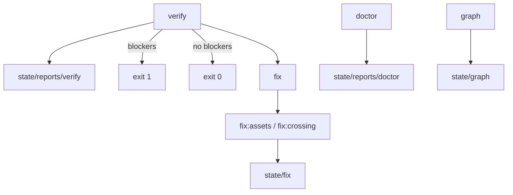

# CLI

Fabryq ships a wrapper (`vendor/bin/fabryq`) and Symfony console commands (`fabryq:*`).

## Wrapper: `vendor/bin/fabryq`
The wrapper maps short aliases to full Symfony commands and auto-detects the project root.

Usage:
```bash
vendor/bin/fabryq <alias> [args...]
```

Alias map:
- `verify` -> `fabryq:verify`
- `review` -> `fabryq:review`
- `doctor` -> `fabryq:doctor`
- `graph` -> `fabryq:graph`
- `assets:install` -> `fabryq:assets:install`
- `app:create` -> `fabryq:app:create`
- `component:create` -> `fabryq:component:create`
- `fix` -> `fabryq:fix`
- `fix assets` -> `fabryq:fix:assets`
- `fix crossing` -> `fabryq:fix:crossing`

Root detection:
- Searches upward for `composer.json` and `bin/console` (max depth 6).

Exit codes:
- `0`: success
- `1`: unknown command
- `2`: project root not found

## Gate flow (high level)


## Commands

### verify
Run all verification gates and write report artifacts.

Syntax:
```bash
vendor/bin/fabryq verify
# or
php bin/console fabryq:verify
```

Outputs:
- `state/reports/verify/latest.json`
- `state/reports/verify/latest.md`

Exit codes:
- `0`: no blockers (warnings allowed)
- `1`: blockers present

### review
Run verification and generate a review report grouped by rule key.

Syntax:
```bash
vendor/bin/fabryq review
```

Output:
- `state/reports/review/latest.md`

Exit codes:
- `0`: no blockers
- `1`: blockers present

### doctor
Evaluate consumed capabilities against resolver winners and app status.

Syntax:
```bash
vendor/bin/fabryq doctor
```

Outputs:
- `state/reports/doctor/latest.json`
- `state/reports/doctor/latest.md`

Exit codes:
- `0`: healthy
- `10`: degraded (winner priority `-1000`)
- `20`: blockers or unhealthy apps
- `30`: unexpected error

### graph
Export the capability graph showing consumes, provider candidates, and winners.

Syntax:
```bash
vendor/bin/fabryq graph [--json] [--mermaid]
```

Options:
- `--json`: write `state/graph/latest.json`
- `--mermaid`: include Mermaid graph in `state/graph/latest.md`

Outputs:
- `state/graph/latest.md`
- `state/graph/latest.json` (with `--json`)

Exit codes:
- `0`: no missing winners and no degraded winners
- `10`: degraded winners
- `20`: missing winners

### assets:install
Publish app and component assets to `public/fabryq`.

Syntax:
```bash
vendor/bin/fabryq assets:install
```

Outputs:
- `state/assets/manifest.json`
- `state/assets/latest.md`

Exit codes:
- `0`: success
- `1`: asset collisions detected

### app:create
Create a new app skeleton.

Syntax:
```bash
vendor/bin/fabryq app:create <AppPascal> [--app-id=<kebab>] [--mount=/<path>]
```

Options:
- `--app-id`: override the app id (defaults to kebab-case slug of name)
- `--mount`: mountpoint path (must start with `/`; no trailing `/` unless it is `/`; no `//`)

Outputs:
- `src/Apps/<AppPascal>/manifest.php`
- `src/Apps/<AppPascal>/Resources/{config,public,templates,translations}/.keep`

Exit codes:
- `0`: success
- `1`: invalid name, invalid app id, mountpoint collision, or existing app

### component:create
Create a new component within an app.

Syntax:
```bash
vendor/bin/fabryq component:create <AppPascal|appId> <ComponentPascal> [--with-public] [--with-templates] [--with-translations]
```

Options:
- `--with-public`: add `Resources/public`
- `--with-templates`: add `Resources/templates`
- `--with-translations`: add `Resources/translations`

Outputs:
- `src/Apps/<AppPascal>/<ComponentPascal>/{Controller,Service,Resources/config}`

Exit codes:
- `0`: success
- `1`: invalid component name, app not found, or slug collision

### fix (dispatcher)
Dispatch autofixers based on available findings.

Syntax:
```bash
vendor/bin/fabryq fix --dry-run|--apply [--all|--file=<path>|--symbol=<symbol>|--finding=<id>]
```

Options:
- `--dry-run`: plan changes without writing
- `--apply`: apply changes to disk
- Selection (use only one): `--all` (default), `--file`, `--symbol`, `--finding`

Exit codes:
- `0`: success or nothing to fix
- `1`: invalid mode or selection, or fixer failure

### fix:assets
Plan or apply asset publishing, including collision handling.

Syntax:
```bash
vendor/bin/fabryq fix assets --dry-run|--apply [--all|--file=<path>|--finding=<id>]
```

Notes:
- `--symbol` is not supported for this fixer.

Outputs:
- Fix plan and run logs under `state/fix/`
- Asset manifest under `state/assets/`

Exit codes:
- `0`: success
- `1`: blocked plan, invalid selection, or apply failure

### fix:crossing
Generate bridge contracts and adapters for cross-app references.

Syntax:
```bash
vendor/bin/fabryq fix crossing --dry-run|--apply [--all|--file=<path>|--symbol=<symbol>|--finding=<id>]
```

Outputs:
- Bridge component under `src/Components/Bridge<ProviderApp>/`
- Adapter in provider app under `Service/Bridge/`
- Updated consumer code and manifests
- Fix plan and run logs under `state/fix/`

Exit codes:
- `0`: success
- `1`: blocked plan, invalid selection, or apply failure

## Typical workflows

### CI gate
```bash
vendor/bin/fabryq verify
```
Fail the build if the exit code is non-zero.

### Resolve cross-app references
```bash
vendor/bin/fabryq verify
vendor/bin/fabryq fix crossing --dry-run --finding=<F-ID>
vendor/bin/fabryq fix crossing --apply --finding=<F-ID>
vendor/bin/fabryq verify
```

### Publish assets
```bash
vendor/bin/fabryq assets:install
```
If collisions exist:
```bash
vendor/bin/fabryq fix assets --dry-run --all
vendor/bin/fabryq fix assets --apply --all
```

### Review output for PRs
```bash
vendor/bin/fabryq review
```
