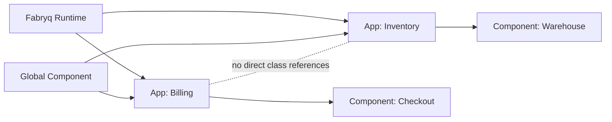

# Concepts

## Vocabulary
- App: A domain slice under `src/Apps/<AppPascal>/` with a `manifest.php` describing capabilities, name, and mountpoint.
- Component: A directory inside an app (any folder except `Resources/` and `Doc/`) that holds controllers, services, entities, and resources.
- Global component: A reusable component under `src/Components/<ComponentPascal>/`. Global components must not reference app classes.
- Capability: A string identifier that represents a contract an app provides or consumes.
- Provider: A class tagged with `#[FabryqProvider(...)]` that implements a contract for a capability.
- Consumer: A manifest `consumes` entry that declares a dependency on a capability.
- Gate: A CLI command that produces a report and exit code (`verify`, `review`, `doctor`, `graph`).
- Finding: A report entry with a `ruleKey`, `severity`, and location metadata.
- Bridge: A generated global component (`Bridge<ProviderApp>`) used to resolve cross-app references.

## System model
Apps run in a shared Symfony runtime. Components are the unit of reuse inside apps. Global components are shared, but cannot reference app classes directly.



## Manifests
Each app has a `manifest.php` that returns a PHP array. Required keys are `appId`, `name`, `mountpoint`, and `consumes`.

```php
<?php

declare(strict_types=1);

return [
    'appId' => 'billing',
    'name' => 'Billing',
    'mountpoint' => '/billing',
    'provides' => [
        [
            'capabilityId' => 'fabryq.bridge.billing.invoice-service',
            'contract' => 'App\\Components\\BridgeBilling\\Contract\\InvoiceServiceInterface',
        ],
    ],
    'consumes' => [
        [
            'capabilityId' => 'fabryq.bridge.inventory.stock-service',
            'required' => true,
            'contract' => 'App\\Components\\BridgeInventory\\Contract\\StockServiceInterface',
        ],
    ],
    'events' => [
        'publishes' => [],
        'subscribes' => [],
    ],
];
```

Manifest validation (enforced by discovery):
- `appId` must be kebab-case (`^[a-z0-9]+(?:-[a-z0-9]+)*$`).
- `mountpoint` must start with `/` and must not end with `/` unless it is `/`.
- Duplicate `mountpoint` values across apps are blocked.

## Capabilities and providers
Providers are registered via the `#[FabryqProvider]` attribute. A compiler pass collects providers, validates them, builds the capability map, and aliases the winning provider to the contract interface.

```php
use Fabryq\Runtime\Attribute\FabryqProvider;
use App\Components\BridgeInventory\Contract\StockServiceInterface;

#[FabryqProvider(capability: 'fabryq.bridge.inventory.stock-service', contract: StockServiceInterface::class, priority: 0)]
final class StockServiceAdapter implements StockServiceInterface
{
}
```

Resolution rules:
- The highest priority provider wins for a capability.
- If priorities tie, the provider with the lowest service id wins (stable sort).
- A NoOp provider uses priority `-1000` to mark a degraded state in `doctor` and `graph`.

## Discovery and structure
- Apps are discovered by scanning `src/Apps/*/manifest.php`.
- Components are discovered as directories inside each app, excluding `Resources/` and `Doc/`.
- Component slugs are derived from directory names and must be valid kebab-case. Collisions are blockers.

## Routing
`FabryqRouteLoader` loads attribute routes from each component `Controller/` folder when the app has a `mountpoint`. Routes are prefixed by the mountpoint and named with:

```
<appId>.<componentSlug>.<routeName>
```

## Resources and assets
- Templates and translations are discovered from `Resources/templates` and `Resources/translations` in apps and components and registered with Twig and the translator.
- Public assets are discovered from `Resources/public` and published to `public/fabryq/...` via the CLI.
- `Resources/config` currently contains an allowlist of files (`services.*`, `routes.*`), but the runtime does not auto-import them yet (planned).

## Base layers and context
`FabryqContext` provides logger, clock, and ULID factory instances without exposing a container. Base classes inject it:
- `AbstractFabryqController`
- `AbstractFabryqCommand`
- `AbstractFabryqUseCase`

## Entities
Doctrine entities must extend `AbstractFabryqEntity` or implement `FabryqEntityInterface` and use `FabryqEntityTrait`. The base entity provides:
- `id` (ULID Base32)
- `createdAt`, `updatedAt`, `deletedAt`, `archivedAt`
- Lifecycle callbacks to set timestamps

## Gates and findings
Gates emit findings and write reports under `state/`. Key artifacts:
- `state/reports/verify/latest.json` and `.md`
- `state/reports/review/latest.md`
- `state/reports/doctor/latest.json` and `.md`
- `state/graph/latest.md` (and `.json` with `--json`)

## Related docs
- [Docs Index](INDEX.md)
- [Project Structure](PROJECT_STRUCTURE.md)
- [Guardrails](GUARDRAILS.md)
- [Getting Started](GETTING_STARTED.md)
